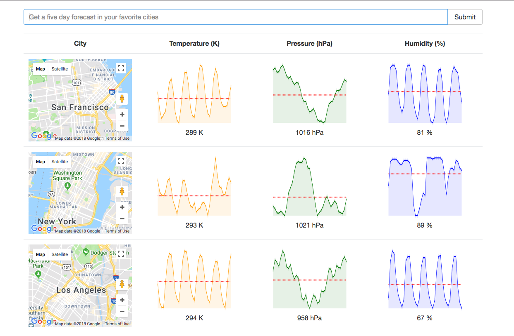

# Weatherly - Simple, Elegant weather

This is a fun project created in [React 16](https://github.com/facebook/react/) with [Redux](https://github.com/reduxjs/redux), [Axios](https://github.com/axios/axios), [OpenWeatherMapAPI](https://openweathermap.org/), and [GoogleMapsAPI](https://cloud.google.com/maps-platform/) to show the 5-day weather forecast in an easily digestible format. 



 [React Sparklines](https://github.com/borisyankov/react-sparklines) were used for the beautiful charts.

### Getting Started

Checkout this repo, install dependencies, then start the gulp process with the following:

```
> git clone https://github.com/puan0601/weatherly_react.git
> cd ReduxSimpleStarter
> npm install
> npm start
```

Navigate your browser to `localhost:8080` to get started! 
